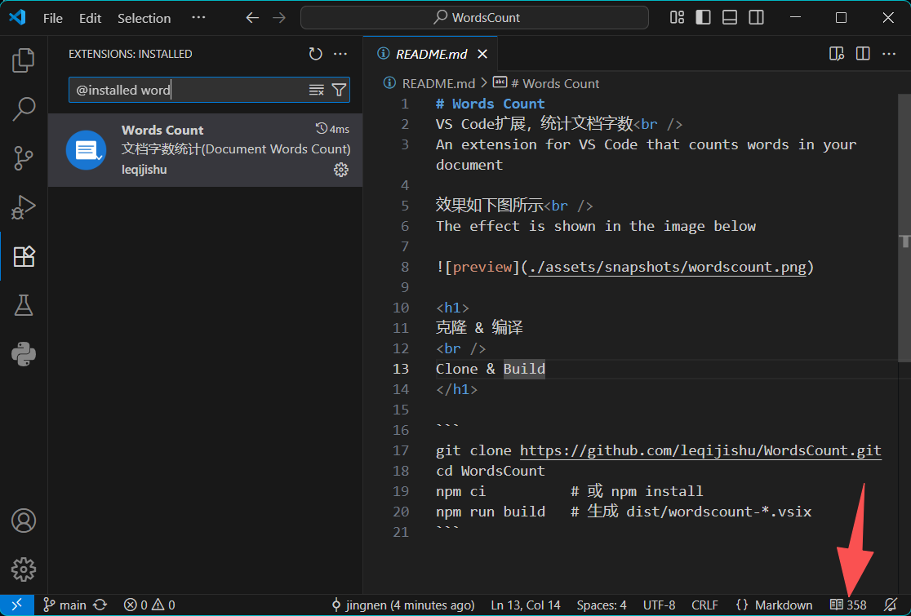

# Words Count
VS Code扩展，统计文档字数
An extension for VS Code that counts words in your document

效果如下图所示
The effect is shown in the image below



# 克隆仓库 & 编译 / clone repository & build

```
git clone https://github.com/leqijishu/WordsCount.git
cd WordsCount
npm ci          # 或 npm install
npm run build   # 生成 dist/wordscount-*.vsix
```